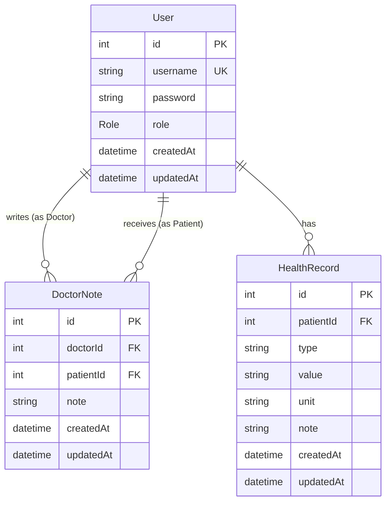

# 📌 ER Diagram: Health Tracker API

## 📋 **Entities & Relationships**

ระบบนี้มี **3 Entity หลัก** และความสัมพันธ์ดังนี้:

1. **User** - เก็บข้อมูลผู้ใช้ (ทั้งแพทย์และผู้ป่วย)
2. **DoctorNote** - บันทึกคำแนะนำของแพทย์ให้กับผู้ป่วย
3. **HealthRecord** - บันทึกสุขภาพของผู้ป่วย

---

## 🔥 **Entity Details**

### **User**

| Column      | Type       | Description                 |
| ----------- | ---------- | --------------------------- |
| `id`        | `Int (PK)` | รหัสผู้ใช้                  |
| `username`  | `String`   | ชื่อผู้ใช้ (Unique)         |
| `password`  | `String`   | รหัสผ่าน (hashed)           |
| `role`      | `Role`     | บทบาท (DOCTOR หรือ PATIENT) |
| `createdAt` | `DateTime` | เวลาที่สร้างบัญชี           |
| `updatedAt` | `DateTime` | เวลาที่อัปเดตล่าสุด         |

### **DoctorNote**

| Column      | Type       | Description          |
| ----------- | ---------- | -------------------- |
| `id`        | `Int (PK)` | รหัสบันทึกคำแนะนำ    |
| `doctorId`  | `Int (FK)` | แพทย์ที่ให้คำแนะนำ   |
| `patientId` | `Int (FK)` | ผู้ป่วยที่รับคำแนะนำ |
| `note`      | `String`   | คำแนะนำจากแพทย์      |
| `createdAt` | `DateTime` | เวลาที่สร้างบันทึก   |
| `updatedAt` | `DateTime` | เวลาที่อัปเดตล่าสุด  |

### **HealthRecord**

| Column      | Type       | Description                  |
| ----------- | ---------- | ---------------------------- |
| `id`        | `Int (PK)` | รหัสบันทึกสุขภาพ             |
| `patientId` | `Int (FK)` | เจ้าของบันทึก (ผู้ป่วย)      |
| `type`      | `String`   | ประเภทข้อมูลสุขภาพ           |
| `value`     | `String?`  | ค่าของข้อมูล (optional)      |
| `unit`      | `String?`  | หน่วย (optional)             |
| `note`      | `String?`  | หมายเหตุเพิ่มเติม (optional) |
| `createdAt` | `DateTime` | เวลาที่สร้างบันทึก           |
| `updatedAt` | `DateTime` | เวลาที่อัปเดตล่าสุด          |

---

## 📌 **Relationships**

- **User (DOCTOR) (1) → (M) DoctorNote** - แพทย์สามารถเขียนบันทึกให้ผู้ป่วยได้หลายรายการ
- **User (PATIENT) (1) → (M) DoctorNote** - ผู้ป่วยสามารถรับบันทึกจากแพทย์ได้หลายรายการ
- **User (PATIENT) (1) → (M) HealthRecord** - ผู้ป่วยสามารถมีบันทึกสุขภาพได้หลายรายการ

---

## 🖼 **ER Diagram**

